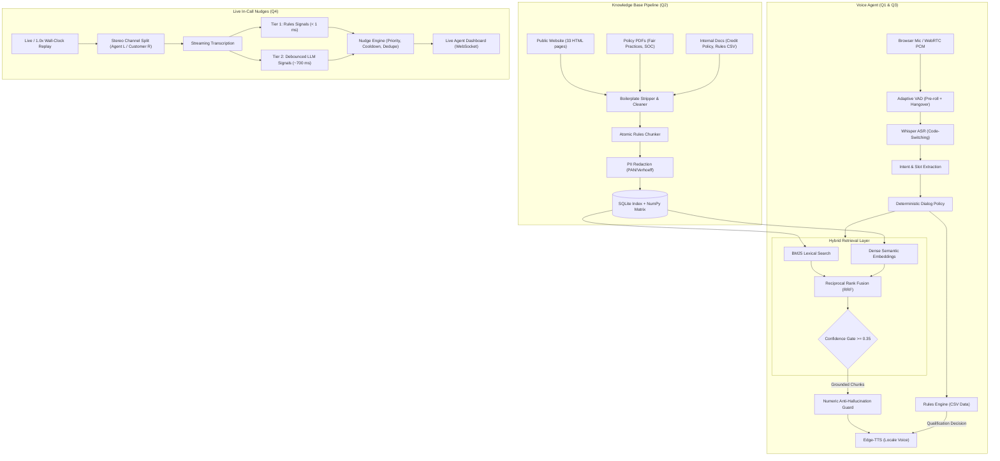

# Darwix AI — AI Engineer Assessment Submission Overview

> **Executive Summary & Evaluation Guide for the Hiring & Review Team**  
> **Candidate Submission:** AI Engineer Technical Assessment  
> **Repository:** `darwix-ai-assessment`  
> **Architecture Principle:** *"The model decides what the customer meant; deterministic code decides everything else."*

---

## 1. Executive Summary

This repository delivers a unified, production-ready AI voice and knowledge architecture addressing all four assessment questions across lending, insurance, and real-time contact center intelligence:

1. **Question 1:** A knowledge-grounded voice agent for Indian NBFC business loan qualification (`en-IN`) with strict compliance gating, numeric anti-hallucination guards, and live browser webcall interface.
2. **Question 2:** A production knowledge base pipeline ingesting real-world public web pages, regulatory PDFs, and internal credit policies into a hybrid-searchable (BM25 + Dense embeddings + RRF), PII-protected, versioned index with 15 pre-declared evaluation tests (14 correct, 1 partial, 0 incorrect).
3. **Question 3:** Native-language financial voice agents localized for the Philippines (life insurance in Taglish) and Indonesia (multifinance in Bahasa Indonesia + Javanese accent) featuring code-switching ASR benchmarking and code-level indirect refusal detection.
4. **Question 4:** A real-time in-call agent assist engine processing streaming stereo audio at 1.0x wall-clock speed with a two-tier signal engine delivering actionable nudges to a live dashboard at **854 ms p50 end-to-end latency**.

### Verifiable Performance & Benchmark Results

Every metric below is generated dynamically by test and evaluation scripts in this repository from committed real audio and transcripts:

| Metric | Result | Benchmark / Evidence Source |
|---|---|---|
| **Retrieval Accuracy** | **14 Correct, 1 Partial, 0 Incorrect** (15 pre-declared queries) | [`evaluation/retrieval_tests.md`](file:///e:/darwix-ai-assessment/evaluation/retrieval_tests.md) |
| **Indexed Records** | **352 searchable** (391 built, 39 PII-redacted & blocked) | `make kb` / [`data/kb/build_stats.json`](file:///e:/darwix-ai-assessment/data/kb/build_stats.json) |
| **Q1 Agent Turn Latency** | **967 ms p50** to decision (ASR 335 ms + Intent/Slots 632 ms) | [`data/transcripts/sim_q1_*.json`](file:///e:/darwix-ai-assessment/data/transcripts) |
| **Q3 ASR Word Error Rate** | **8.8%** (`en-IN`), **9.5%** (Taglish), **11.9%** (`id-ID`), **25.0%** (Javanese) | [`evaluation/asr_benchmark.md`](file:///e:/darwix-ai-assessment/evaluation/asr_benchmark.md) |
| **Q4 Live Nudge Latency** | **854 ms p50**, **1,228 ms p95** (End-to-end: Audio In → Nudge Rendered) | [`evaluation/latency_report.md`](file:///e:/darwix-ai-assessment/evaluation/latency_report.md) |
| **Q4 Scenario Accuracy** | **4 of 4 passed**; 16.7% upper-bound false-positive rate | [`evaluation/false_positive_analysis.md`](file:///e:/darwix-ai-assessment/evaluation/false_positive_analysis.md) |
| **Automated Unit Tests** | **207+ passing tests** (100% offline, zero API keys required) | `pytest tests/ -q` |

---

## 2. Assessment Deliverable Matrix

| Deliverable | Use Case & Locale | Core Architecture | Code & Config | Evidence & Verification |
|---|---|---|---|---|
| **Q1: Grounded Voice Agent** | Indian NBFC Business Loan Qualification (`en-IN`) | Browser WebRTC/WebSocket audio, VAD, Whisper ASR, 5 Grounding Gates, CSV Rules Engine, Disclosures | [`src/darwix/voice/`](file:///e:/darwix-ai-assessment/src/darwix/voice), [`src/darwix/server/app.py`](file:///e:/darwix-ai-assessment/src/darwix/server/app.py) | 5 recorded audio calls & transcripts ([`data/recordings/`](file:///e:/darwix-ai-assessment/data/recordings)), Live UI at `/webcall` |
| **Q2: Production Knowledge Base** | Real Listed NBFC Website + Policy PDFs + Internal Docs | Playwright crawler, frequency-based boilerplate cleaner, atomic rule chunker, PII redaction, BM25 + Gemini embeddings + RRF | [`src/darwix/kb/`](file:///e:/darwix-ai-assessment/src/darwix/kb), [`config/sources.yaml`](file:///e:/darwix-ai-assessment/config/sources.yaml) | 15 pre-declared test queries ([`evaluation/retrieval_tests.md`](file:///e:/darwix-ai-assessment/evaluation/retrieval_tests.md)), Explorer UI at `/kb` |
| **Q3: Native-Language Bots** | Philippines Life Insurance (Taglish) & Indonesia Multifinance (Bahasa + Javanese) | Shared core engine driven by locale packs, code-switching ASR, cultural politeness (`po`/`opo`), indirect refusal detection | [`src/darwix/voice/locales/`](file:///e:/darwix-ai-assessment/src/darwix/voice/locales), [`src/darwix/evaluation/asr_benchmark.py`](file:///e:/darwix-ai-assessment/src/darwix/evaluation/asr_benchmark.py) | 4 recorded audio calls, [`evaluation/asr_benchmark.md`](file:///e:/darwix-ai-assessment/evaluation/asr_benchmark.md) |
| **Q4: Live Call Nudges** | Contact Center Live Agent Assist & Compliance | 1.0x wall-clock replay, stereo channel split, two-tier detection (sub-ms rules + debounced LLM), nudge engine | [`src/darwix/realtime/`](file:///e:/darwix-ai-assessment/src/darwix/realtime) | Real-time replay harness, [`evaluation/latency_report.md`](file:///e:/darwix-ai-assessment/evaluation/latency_report.md), Live UI at `/dashboard` |

---

## 3. End-to-End System Architecture



---

## 4. Key Architectural & Design Decisions

### 1. "The Model Understands; Code Decides"
In financial and lending interactions, a model under conversational pressure will hallucinate interest rates, skip legal disclaimers, or miscalculate eligibility. 
- **Model Role:** Decodes messy customer speech and renders verified factual citations into natural language.
- **Code Role:** 
  - Mandatory legal disclosures (AI identity, call recording, intent).
  - Qualification threshold comparisons (e.g., turnover, credit score, vintage).
  - Escalation triggers (human request, distress language, unanswerable queries).
  - Grounding validation & numeric verification.

### 2. Five Strict Grounding Gates (Zero Factual Invention)
When a customer asks a factual question:
1. **Retrieve First:** No factual statement without an indexed retrieval match.
2. **Confidence Floor:** If top RRF score $< 0.35$, the agent immediately admits ignorance and offers a human handoff.
3. **Explicit Model Decline:** The LLM is instructed and permitted to return `false` if retrieved chunks do not answer the query.
4. **Citation Verification:** Every output must reference valid `record_id`s present in retrieved chunks.
5. **Strict Numeric Guard:** *Every number in the generated response must exist verbatim in the source chunk*. This explicitly prevents rate-smearing (e.g. converting "14.5% to 16.0%" into "around 15%").

### 3. Rules as Data (Not System Prompts)
Lending qualification criteria live in `data/raw/internal/qualification_rules.csv`. Changing a minimum turnover cut-off is a CSV edit and index rebuild—with an automatic version bump and audit trail—rather than prompt engineering. The engine evaluates `pass`, `refer`, and `reject` deterministically.

### 4. Why No Vector Database?
With 352 searchable records, brute-force cosine similarity over a 768-dimensional NumPy float32 matrix executes in **$< 0.2\text{ ms}$**—three orders of magnitude faster than an ASR API call. Introducing Pinecone, Qdrant, or Chroma would add external service dependencies and network overhead without benefit. (The exact scaling inflection point—$\sim 25$ concurrent calls—is fully documented in [`docs/limitations_and_production_plan.md`](file:///e:/darwix-ai-assessment/docs/limitations_and_production_plan.md)).

### 5. True Real-Time Replay for Q4
The Q4 evaluation pipeline streams audio in real time at **1.0x wall-clock speed** (`speed=1.0`), pausing between chunks. The signal extraction and nudge layers *cannot* inspect future audio that has not yet occurred on a live call.

---

## 5. Quick Start & Interactive Interfaces

### Prerequisites
- Python 3.11+
- Free-tier API keys: Google AI Studio (`GEMINI_API_KEY`) and Groq (`GROQ_API_KEY`). *(Unit tests run 100% offline with no keys needed).*

### 1. Installation & Offline Test Suite
```bash
# Clone & set up environment
cp .env.example .env      # Add GEMINI_API_KEY and GROQ_API_KEY
make install              # Editable install + Playwright Chromium
make test                 # 207+ unit tests execute instantly (offline, zero API keys)
```

### 2. Launch Interactive Web Applications
```bash
make serve                # Starts FastAPI server on http://127.0.0.1:8000
```
Open your browser to explore the 3 dedicated interfaces:

| Path | Web Interface | Description & Review Experience |
|---|---|---|
| [`/webcall`](http://127.0.0.1:8000/webcall) | **Interactive Voice Agent** | Conduct a live call in your browser. Features real-time PCM streaming, adaptive VAD, barge-in interruption, live transcripts, and an **inspectable citation drawer** displaying the exact document chunk backing every factual statement. |
| [`/kb`](http://127.0.0.1:8000/kb) | **Knowledge Base Explorer** | Search the indexed corpus interactively. Inspect BM25 scores, dense semantic similarity, RRF fused rankings, confidence gating, and PII protection filters. |
| [`/dashboard`](http://127.0.0.1:8000/dashboard) | **Real-Time Agent Assist** | Watch live stereo call playback alongside streaming transcripts. Observe compliance alarms, missed cross-sell opportunities, and customer frustration nudges appearing in under 1 second. |

### 3. Reproducing Evidence & Benchmark Reports
```bash
make check       # Runs unit tests + KB rebuild + retrieval evaluation
make eval        # Evaluates 15 test queries -> evaluation/retrieval_tests.md
make sim         # Runs all 9 simulated voice agent calls (generates audio + transcripts)
make asr-bench   # Compares ASR WER across locales -> evaluation/asr_benchmark.md
make q4-eval     # Replays all 4 Q4 scenarios in real-time -> evaluation/latency_report.md
```

---

## 6. Question-by-Question Deep Dive

### Question 1: Knowledge-Grounded Voice Agent (`en-IN`)
- **Use Case:** Small business loan qualification for an Indian NBFC.
- **Dialog Flow:** `Greeting` → `Consent` → `Mandatory Disclosures` → `Qualification Slots` → `Outcome` → `CRM / Escalation`.
- **Interruption Resilience:** Customers can ask questions, raise objections ("Are there hidden charges?"), or request a human at any point; the state machine answers, confirms grounding, and smoothly resumes qualification.
- **Opening Compliance:** Mandatory delivery of 3 legal disclosures (AI bot identity, call recording notice, loan inquiry purpose) enforced by code. Disclosures interrupted mid-stream are automatically queued for re-delivery before qualification begins.
- **Deterministic Qualification:** Evaluates entity type (Proprietorship, LLP, Pvt Ltd), business vintage ($\ge 24$ months), annual turnover ($\ge \text{Rs. } 40\text{ Lakh}$), and bureau score ($\ge 675$) yielding `pass`, `refer` (borderline cases), or `reject`.
- **Business Actions:** Automatically persists qualified leads to CRM (`data/crm/leads.jsonl`) and dispatches escalation webhooks upon human handover.

### Question 2: Production-Ready Knowledge Base
- **Data Ingestion:** 33 public pages and 7 regulatory policy PDFs from a listed Indian NBFC (UGRO Capital) + 5 synthetic internal credit documents (credit policy, qualification rules CSV, objection handbook, application form, mock leads).
- **Extraction & Cleaning:** Playwright headless scraper for JS-rendered pages. Detects soft-404 pages with HTTP 200 status. Removes boilerplate (headers, footers, navs) via cross-corpus n-gram frequency analysis rather than fragile CSS selectors.
- **Chunking & Normalization:** Heading-aware 250–400 token chunks with 60-token overlap. Rule tables kept atomic. Normalization maps financial terms (`EMI`, `foreclosure`, `vintage`) and amounts (`45 lakh` $\rightarrow 4500000$) as search aliases *without rewriting original source citations*.
- **PII Governance:** Identifies PANs (format + checksum), Aadhaar numbers (Verhoeff algorithm), phone numbers, and emails. 39 records containing PII are quarantined and permanently blocked from retrieval queries (verified by test `RT11`).
- **Hybrid Retrieval & RRF:** Combines BM25 keyword matching with 768d Gemini semantic embeddings using Reciprocal Rank Fusion ($k=60$). Gracefully falls back to pure BM25 in offline environments.

### Question 3: Native-Language Voice Agents (Philippines & Indonesia)
- **Localisation, Not Translation:** Implemented via decoupled per-market **Locale Packs** (`src/darwix/voice/locales/`):
  - **Philippines (`ph_taglish`):** Life insurance / bancassurance sector. Handles fluid Tagalog-English code-switching, cultural honorifics (`po` / `opo`), local payment rails (GCash, OTC), and specific objections ("Is this a scam?").
  - **Indonesia (`id_bahasa`):** Multifinance / consumer installment loans (*cicilan*, *tenor*, *denda* 0.5%/day, Indomaret/virtual accounts). Handles formal and colloquial Bahasa, plus regional Javanese accent variations.
- **Indirect Refusal Detection:** In Indonesian business culture, customers rarely say a blunt "no". The phrase *"Nanti saya kabari deh"* ("I'll let you know later") is a polite refusal. If treated as a positive promise-to-pay, it corrupts collections queues. Our engine detects indirect refusal patterns deterministically in code.
- **ASR Dialect & Code-Switching Benchmark:** Evaluated against reference transcripts:
  - `en-IN`: 8.8% WER | `Taglish`: 9.5% WER | `id-ID`: 11.9% WER | `Javanese accent`: 25.0% WER (quantifying regional acoustic challenges).

### Question 4: Real-Time Live Nudges & Insights
- **Streaming Pipeline:** Processes stereo audio with physical channel isolation (Agent on Left, Customer on Right), removing the need for computationally heavy diarization models.
- **Two-Tier Signal Architecture:**
  - **Tier 1 — Deterministic Rules ($< 1\text{ ms}$):** Evaluates compliance deadlines (e.g. required disclosures missing after Turn 2) and forbidden guarantee phrasing.
  - **Tier 2 — Debounced LLM Signals ($\sim 700\text{ ms}$):** Concurrently detects multi-turn buying signals, customer frustration escalation, and missed cross-sell opportunities (e.g. customer mentioning a second commercial vehicle).
- **Nudge Engine Arbitration:** Implements per-signal confidence thresholds, cooldown periods (preventing alert fatigue), duplicate suppression, priority ranking, and short imperative prompts (*"Careful — reframe guarantee: decision rests with credit"*).
- **Latency Profile:** **854 ms p50**, **1,228 ms p95** from speech completion to live dashboard push.

---

## 7. Critical Engineering Challenges & Solutions

| Challenge & Bug Discovered | Root Cause Traced | Robust Engineering Solution |
|---|---|---|
| **Whisper Hallucinating "Thank You." on Silence** | The adaptive noise floor had no lower bound in quiet rooms, decaying from 0.0229 to 0.0012. Quiet breathing was flagged as speech; Whisper transcribes near-silence into subtitle training artifacts (`"Thank you."`, `"Thanks for watching!"`). | 1) Bounded the noise floor at both ends.<br>2) Implemented an absolute audio energy gate before ASR.<br>3) Added multi-language subtitle artifact filtering. |
| **Noise Floor Latching in Loud Rooms** | In noisy environments ($> 0.013\text{ RMS}$), constant sound was classified as speech, freezing the noise floor adapter and locking VAD permanently open. | Rewrote noise floor estimation to sample a low percentile over a rolling 15-second sliding window, adapting during natural inter-word speech pauses. |
| **Japanese Subtitle Artifacts on Indian Calls** | Whisper language auto-detection misidentified background line static as Japanese (`ご視聴ありがとうございました`). | Implemented per-market whitelist of plausible spoken languages; out-of-locale noise hallucinations are discarded. |
| **Acoustic Feedback / Self-Talk** | The microphone picked up the agent's synthesized voice from speakers, creating an infinite conversation loop. | Elevated VAD threshold dynamically during agent audio playback: quiet bleed is ignored while genuine loud customer barge-in is preserved. |

---

## 8. Honest Limitations & Production Scaling Plan

As detailed in [`docs/limitations_and_production_plan.md`](file:///e:/darwix-ai-assessment/docs/limitations_and_production_plan.md), the system's current architectural boundaries and production roadmap are:

1. **Telephony & Network Layer:** Current implementation uses 16 kHz WebRTC/WebSocket PCM audio. Production deployment will bridge SIP/PSTN trunking via Asterisk/FreeSWITCH or LiveKit, accommodating 8 kHz G.711 codecs, jitter buffers, and packet loss.
2. **Streaming Text-to-Speech:** `edge-tts` is used for high-quality free multilingual voices but operates non-streamingly ($\sim 1.4\text{ s}$ synthesis per utterance). Upgrading to a streaming commercial engine (e.g. ElevenLabs or Azure Speech) will drop perceived latency by $\sim 1\text{ second}$.
3. **Neural VAD:** Energy-based VAD performs reliably with stationary noise but struggles with non-stationary street noise (e.g. Manila jeepneys or Jakarta traffic). A drop-in Silero neural VAD ($< 1\text{ ms}$ on CPU) is designed for production integration.
4. **Data Scale & Concurrency Breakpoints:**
   - **Current:** Single-node SQLite + in-memory NumPy matrix ($< 1\text{ ms}$ for 352 records).
   - **$\ge 25$ Concurrent Calls:** Transition to PostgreSQL + `pgvector` with Redis session state to prevent multi-process memory duplication.

---

## 9. Repository Navigation & Evidence Index

```
darwix-ai-assessment/
├── SUBMISSION_OVERVIEW.md         # This comprehensive executive guide
├── README.md                      # Quick-start documentation & repo orientation
├── IMPLEMENTATION.md              # In-depth architectural narrative & engineering rationale
├── Makefile                       # One-stop operational automation commands
├── pyproject.toml                 # Packaging & dependencies
├── config/
│   ├── retrieval_tests.yaml       # 15 pre-declared evaluation test queries
│   ├── sources.yaml               # Crawler & document registry
│   └── taxonomy.yaml              # Domain categorization schema
├── data/
│   ├── recordings/                # 32 committed call recordings (.mp3 & .wav)
│   ├── transcripts/               # Per-turn JSON transcripts with grounding audits
│   ├── kb/                        # Indexed SQLite database & NumPy embeddings
│   └── crm/leads.jsonl            # Automated CRM business action output
├── docs/
│   ├── architecture.md            # System architecture & sequence diagrams
│   ├── q1_voice_agent.md          # Q1 design, grounding gates & state machine
│   ├── q2_knowledge_base.md       # Q2 crawler, cleaner, chunker & RRF retrieval
│   ├── q3_multilingual.md         # Q3 localization packs, Taglish & Bahasa design
│   ├── q4_realtime.md             # Q4 streaming pipeline, signals & nudge engine
│   └── limitations_and_production_plan.md # Honest scaling & production analysis
├── evaluation/
│   ├── retrieval_tests.md         # Detailed results for 15 retrieval test queries
│   ├── asr_benchmark.md           # ASR Word Error Rate comparison across dialects
│   ├── latency_report.md          # Q4 end-to-end and component latency distributions
│   └── false_positive_analysis.md # Q4 signal precision & false-positive audit
├── src/darwix/
│   ├── common/                    # ASR, TTS, LLM client, audio DSP, latency tracking
│   ├── kb/                        # Crawl, clean, chunk, PII filter, index & retrieve
│   ├── voice/                     # Dialog policy, slots, qualification, grounding, locales
│   ├── realtime/                  # Stream ingestion, signal rules, LLM nudges, pipeline
│   ├── simulator/                 # Persona generation & synthetic caller audio loop
│   └── server/                    # FastAPI app, WebSocket routes & static web UIs
├── tests/                         # 207+ pytest test cases across all modules
└── web/                           # Front-end UIs (/webcall, /kb, /dashboard)
```

---

## 10. Summary for Evaluators

This submission approaches the assessment not as four disconnected exercises, but as **a coherent, industrial-grade voice AI platform**. Every claim is backed by reproducible automated tests, pre-declared benchmark datasets, and auditable audio recordings. 

All interfaces, pipelines, and evaluation harnesses are fully runnable via the provided `Makefile` commands.
