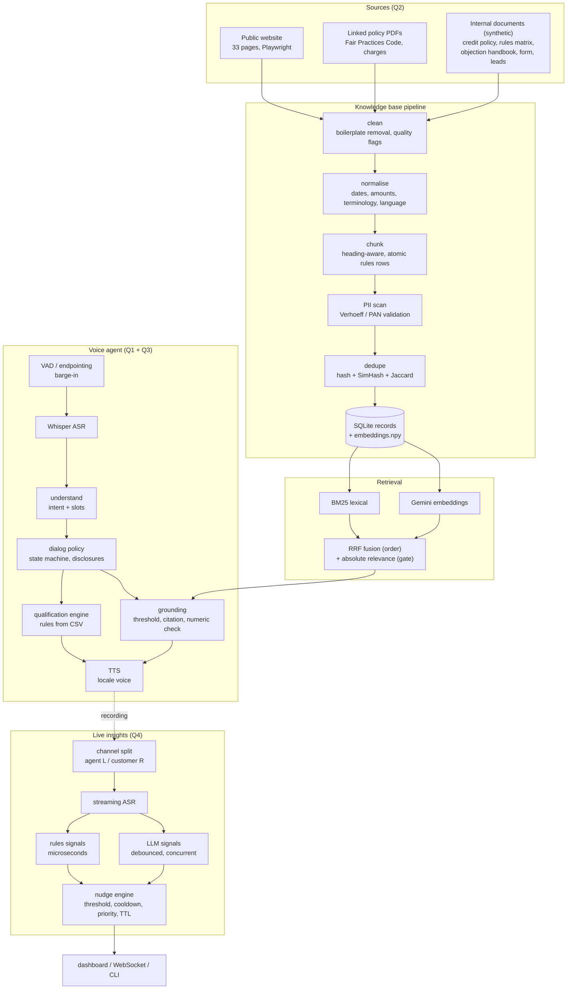
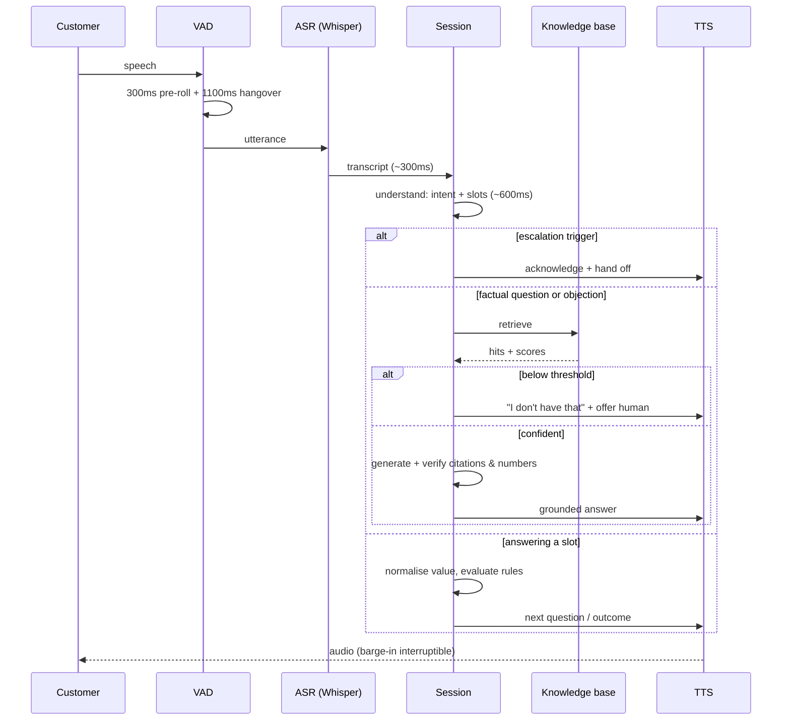

# Architecture

Four deliverables, one system. The reason they share a codebase rather than
sitting in four folders is that Q1 and Q3 are the *same* agent with different
locale packs, and Q4 reuses Q1's audio layer to listen to a call instead of
conducting one. Duplicating any of that would have meant three VADs to tune and
three places for a compliance rule to be wrong.

## System



## The one decision that shapes everything

**The model is never the source of truth.**

| Concern | Owned by | Not by |
|---|---|---|
| What the customer meant | LLM | - |
| What the customer said (values) | LLM extracts, code normalises | LLM arithmetic |
| Whether they qualify | `qualification.py` + rules CSV | the prompt |
| What must be disclosed, and when | `dialog_policy.py` | the prompt |
| Whether a factual claim is allowed | `grounding.py` + retrieval threshold | the model's confidence |
| When to escalate to a human | `escalation.py` | the model's judgement |
| Which nudge reaches the agent | `nudge_engine.py` | the signal's own confidence |

Every one of these was a deliberate move *out* of the prompt, because each is a
place where a fluent model will confidently do the wrong thing under
conversational pressure.

## Call flow (Q1 / Q3)



## Model routing, and why

Measured, not assumed — see `evaluation/model_selection.md`.

| Job | Model | Why |
|---|---|---|
| Dialogue (Q1/Q3) | Groq `openai/gpt-oss-120b`, `reasoning_effort=low` | 923 ms median, and it answered in the customer's own language and register in every Taglish and Bahasa test |
| Q4 signal extraction | Groq `openai/gpt-oss-20b` | ~810 ms for short structured JSON; the job is classification, not conversation |
| KB classification, ASR benchmark, customer simulation | Gemini 3.6 Flash | 16-38 s per turn on this free tier, so it is used only where latency does not matter |
| ASR | Groq `whisper-large-v3-turbo` | Handles Taglish and Bahasa code-switching in one pass instead of forcing a language decision per turn |
| Embeddings | Gemini `gemini-embedding-001` (768d) | Free tier, asymmetric document/query task types |
| TTS | `edge-tts` | The only free option with native `fil-PH`, `id-ID`, and regional `jv-ID` / `su-ID` voices |

## Data flow and storage

```
data/
├── raw/                  # crawler snapshots + synthetic internal docs (regenerable)
│   ├── web/              #   33 HTML pages + manifest
│   ├── web_pdf/          #   7 policy PDFs fetched from the site
│   ├── internal/         #   authored: credit policy, rules CSV, handbook, form, leads
│   └── markets/          #   authored: PH life insurance + ID multifinance KBs (Q3)
├── interim/
│   └── documents.jsonl   # cleaned documents, committed - the KB rebuilds offline from here
├── kb/
│   ├── records.jsonl     # the knowledge base itself
│   ├── index.sqlite      # records + metadata, with the PII filter in SQL
│   ├── embeddings.npy    # (n, 768) float32; PII rows are zero vectors
│   ├── embedding_cache.jsonl  # keyed by content checksum -> only changed records re-embed
│   ├── versions/         # content-addressed snapshots per build
│   └── build_stats.json  # what was ingested, merged, flagged, skipped
├── transcripts/          # per-call JSON: turns, slots, decisions, latency
├── recordings/           # stereo calls (agent L / customer R), mp3 committed
└── crm/leads.jsonl       # the business action: one lead row per completed call
```

## Why there is no vector database

The corpus is a few hundred records. A brute-force cosine over an `(n, 768)`
float32 matrix is well under a millisecond — three orders of magnitude below the
ASR call it sits behind. Adding Chroma, FAISS or Qdrant would add a service to
run, a build dependency on Windows, and no measurable retrieval benefit.

The point at which that stops being true, and what replaces it, is in
`limitations_and_production_plan.md` rather than pretended away.
